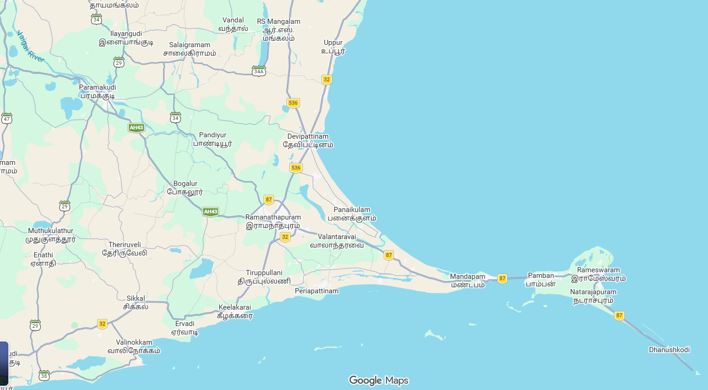
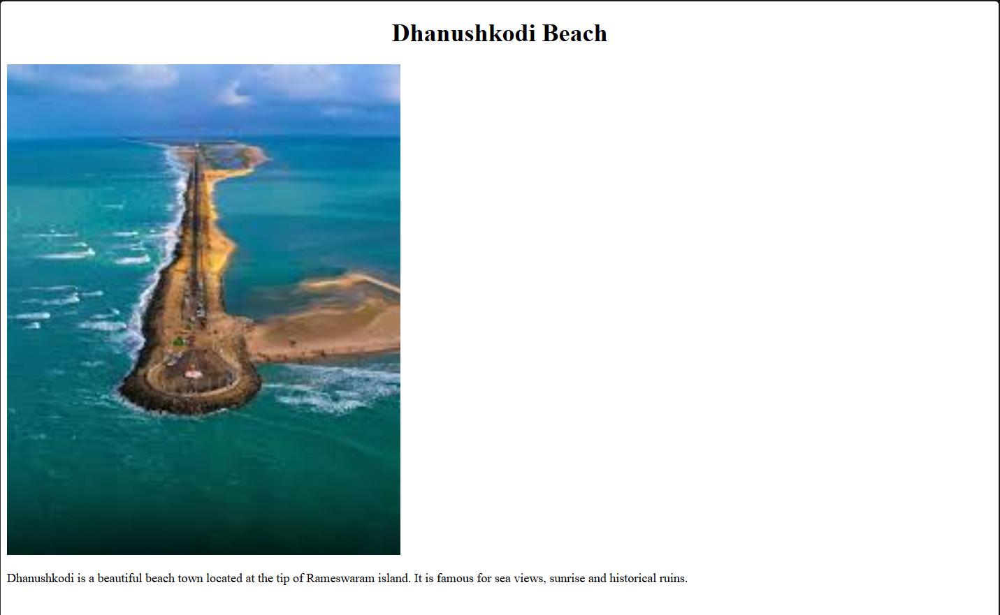
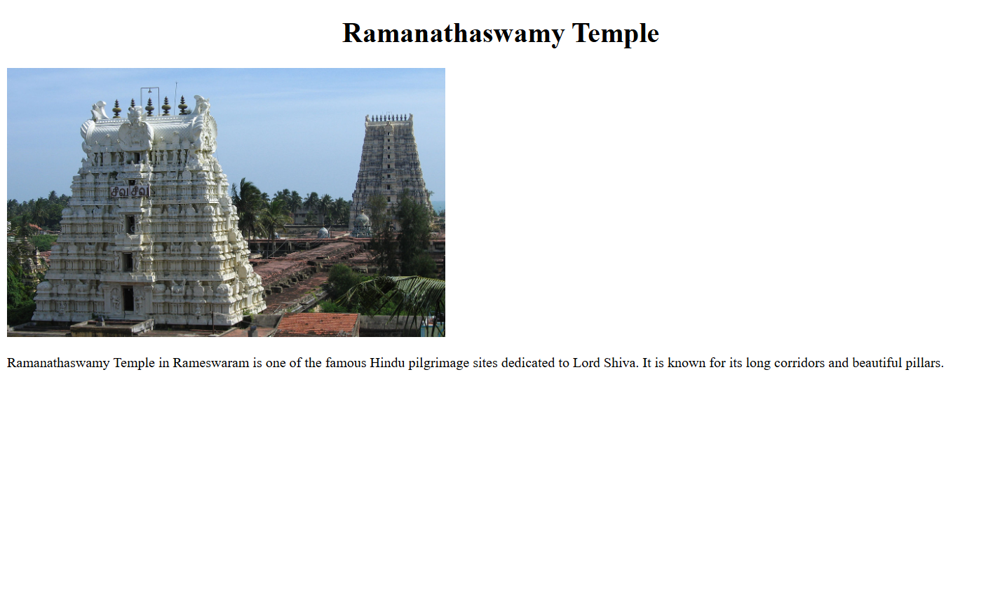
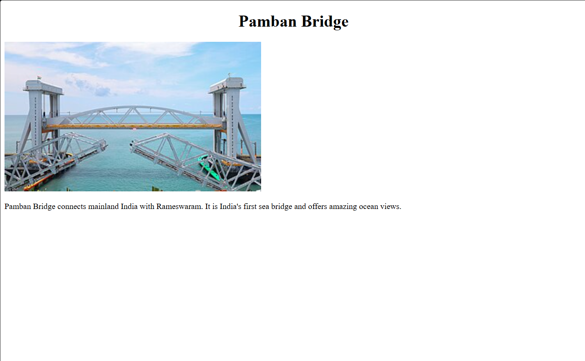
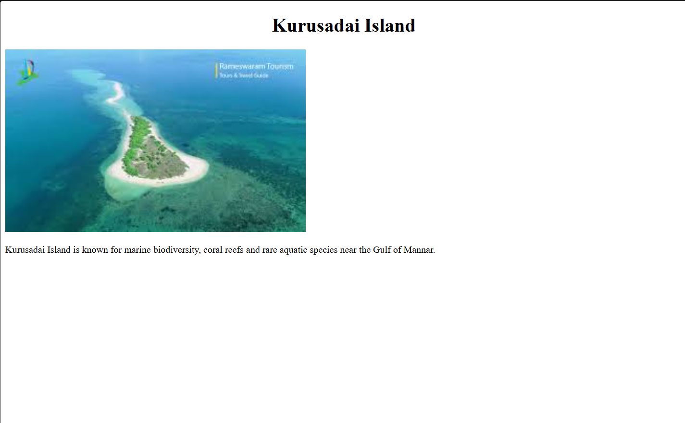

# Ex03 Places Around Me
## Date: 21-05-2026

## AIM
To develop a website to display details about the places around my house.

## DESIGN STEPS

### STEP 1
Create a Django admin interface.

### STEP 2
Download your city map from Google.

### STEP 3
Using ```<map>``` tag name the map.

### STEP 4
Create clickable regions in the image using ```<area>``` tag.

### STEP 5
Write HTML programs for all the regions identified.

### STEP 6
Execute the programs and publish them.

## CODE
```
index.html:

<!DOCTYPE html>
<html lang="en">
    <head>
        <meta charset="UTF-8">
        <meta name="viewport" content="width=device-width, initial-scale=1.0">
        <title>Ramanathapuram Map</title>
    </head>

    <body>


<map name="image-map">
    <area target="" alt="beach" title="beach" href="beach.html" coords="1325,683,1479,794" shape="rect">
    <area target="" alt="temple" title="temple" href="temple.html" coords="587,482,63" shape="circle">
    <area target="" alt="bridge" title="bridge" href="bridge.html" coords="1060,633,1131,624,1125,560,1054,550" shape="poly">
    <area target="" alt="island" title="island" href="island.html" coords="1117,649,17" shape="circle">
</map>

    </body>
</html>

beach.html

<!DOCTYPE html>
<html>
<head>
<title>Dhanushkodi Beach</title>
</head>

<body>

<h1 align="center">
Dhanushkodi Beach
</h1>


<p>
Dhanushkodi is a beautiful beach town located at the
tip of Rameswaram island. It is famous for sea views,
sunrise and historical ruins.
</p>

</body>
</html>

temple.html

<!DOCTYPE html>
<html>
<head>
<title>Rameswaram Temple</title>
</head>

<body>

<h1 align="center">
Ramanathaswamy Temple
</h1>


<p>
Ramanathaswamy Temple in Rameswaram is one of the
famous Hindu pilgrimage sites dedicated to Lord Shiva.
It is known for its long corridors and beautiful pillars.
</p>

</body>
</html>

bridge.html:

<!DOCTYPE html>
<html>
<head>
<title>Pamban Bridge</title>
</head>

<body>

<h1 align="center">
Pamban Bridge
</h1>


<p>
Pamban Bridge connects mainland India with Rameswaram.
It is India's first sea bridge and offers amazing ocean views.
</p>

</body>
</html>

island.html:

<!DOCTYPE html>
<html>
<head>
<title>Kurusadai Island</title>
</head>

<body>

<h1 align="center">
Kurusadai Island
</h1>


<p>
Kurusadai Island is known for marine biodiversity,
coral reefs and rare aquatic species near the Gulf of Mannar.
</p>

</body>
</html>
```
## OUTPUT











## RESULT
The program for implementing image maps using HTML is executed successfully.
